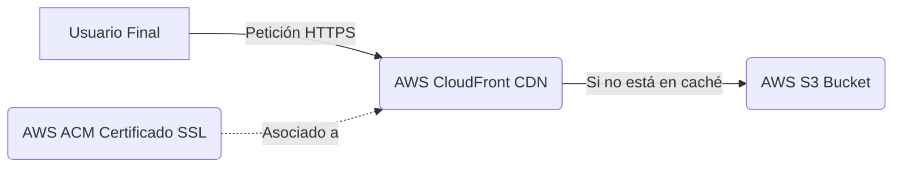

# Arquitectura del Proyecto

Este documento detalla la arquitectura en AWS para desplegar el sitio estático y provee las instrucciones paso a paso para levantar la infraestructura desde cero usando tofu (OpenTofu).

## Servicios Utilizados
- **AWS S3:** Almacenamiento y hosting de los archivos estáticos de la web (HTML, CSS, JS).
- **AWS CloudFront:** Red de entrega de contenido (CDN) que cachea el contenido estático a nivel mundial, logrando menor latencia y proveyendo HTTPS.
- **AWS ACM (AWS Certificate Manager):** Provisión del certificado SSL/TLS (ubicado en `us-east-1` por requerimientos de CloudFront) para asegurar la conexión.

## Diagrama de Arquitectura



## Guía de Despliegue desde Cero

Para levantar esta infraestructura, los módulos están ordenados y orquestados dentro del directorio `iaac/app`. 

### Prerrequisitos
- Tener instalado **tofu** u **OpenTofu**.
- Tener configuradas las credenciales de AWS localmente (por ejemplo, con el perfil `argly`).

### Pasos

1. **Navegar al directorio de la aplicación de infraestructura:**
   ```bash
   cd iaac/app
   ```

2. **Inicializar tofu:**
   Esto descargará los proveedores necesarios y configurará el backend.
   ```bash
   tofu init
   ```

3. **Validar la configuración (opcional pero recomendado):**
   ```bash
   tofu validate
   ```

4. **Verificar el plan de ejecución:**
   Visualiza los recursos que van a ser creados, como los buckets S3, certificados ACM y la distribución CloudFront.
   ```bash
   tofu plan
   ```

5. **Aplicar los cambios:**
   Construye la infraestructura. Te pedirá confirmación escribiendo `yes`.
   ```bash
   tofu apply
   ```

Opcional:

`aws s3 sync ./out s3://argly-web-static --profile argly --delete`

### Pasos post-despliegue
Al ejecutar el `apply`, tofu mostrará algunos *outputs* importantes:
- `cloudfront_domain_name`: Debes configurar un registro CNAME en tu proveedor de DNS que apunte de `www.argly.com.ar` hacia este dominio.
- `cert_validation_name` y `cert_validation_value`: Deberás ingresar estos registros tipo CNAME en tu proveedor de DNS para validar la propiedad del dominio y permitir que el certificado de ACM sea emitido. Una vez emitido, CloudFront comenzará a operar correctamente.
